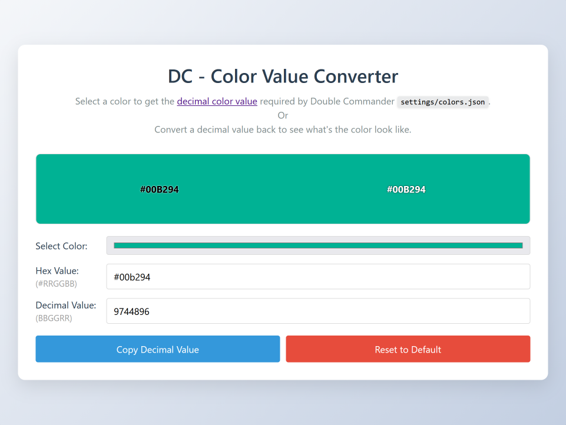

# DC Color Value Converter

Select a color to get the [decimal color value](https://doublecmd.github.io/doc/en/configuration.html#ConfigToolsEditorHL) required by Double Commander `settings/colors.json`.
Or
Convert a decimal value back to see what's the color look like.

